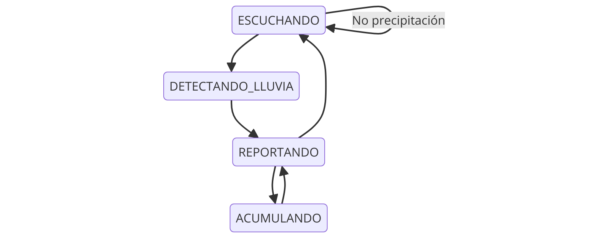

# Proyecto Pluviómetro con MBED y STM32 NUCLEO F429ZI

**Autor: Luis Gómez P.**

## Descripción

Este proyecto implementa un sistema de pluviómetro utilizando la plataforma MBED sobre un microcontrolador STM32 en la placa NUCLEO F429ZI. El sistema mide la cantidad de lluvia mediante un sensor de ticks y reporta la acumulación a través de comunicación serial.

*Figura 1: Esquema de un pluviómetro de balancín (fuente: Segerer et al., 2006)*

## Características

- Detección precisa de precipitación mediante sensor de ticks.
- Acumulación y reporte de lluvia en intervalos configurables.
- Indicación visual de detección de lluvia mediante LED.
- Comunicación serial para reportes y configuración.
- Manejo de tiempo real para timestamping preciso de los eventos.
- Configuración de ubicación geográfica (coordenadas UTM).

## Componentes de Hardware

*Figura 2: Esquema de componentes del pluviómetro*

- Placa STM32 NUCLEO F429ZI
- Sensor de lluvia (simulado con un botón en esta implementación)
- LED para indicación visual

## Estructura del Software

*Figura 3: Diagrama de flujo del funcionamiento del pluviómetro*

El software está organizado en varios módulos:

- `pluviometer.h`: Declaraciones de la API pública del pluviómetro.
- `pluviometer.c`: Implementación de las funciones del pluviómetro.
- `main.cpp`: Programa principal que inicializa y ejecuta el sistema.

### Funciones Principales

- `pluviometro_init()`: Inicializa el pluviómetro.
- `pluviometro_actualizar()`: Actualiza el estado del pluviómetro y maneja los eventos.
- `pluviometro_reportar_lluvia()`: Genera un reporte de la lluvia acumulada.
- `pluviometro_configurar_intervalo()`: Configura el intervalo de reporte.
- `pluviometro_configurar_fecha_hora()`: Configura la fecha y hora del sistema.
- `pluviometro_configurar_ubicacion()`: Configura las coordenadas UTM del pluviómetro.

### Maquina de estados Finitos (FSM)

*Figura 3: Diagrama FSM del funcionamiento del pluviómetro*

## Uso

1. Clone el repositorio:
git clone [URL_DEL_REPOSITORIO]

2. Abra el proyecto en su entorno de desarrollo MBED.

3. Compile y cargue el código en la placa NUCLEO F429ZI.

4. Conecte el sensor de lluvia (o simule con el botón de usuario) y observe los reportes a través de la comunicación serial.

## Configuración

Puede ajustar los siguientes parámetros en el código:

- `DEBOUNCE_TIME_MS`: Tiempo de debounce para el sensor en milisegundos.
- `TICK_VALUE`: Valor de precipitación por cada tick del sensor.
- `TIEMPO_REPORTE_PLUVIOMETRO`: Intervalo de reporte en segundos.

## Ejemplo de Salida
'''
    Pluviometro inicializado.
    Intervalo de reporte: 60 segundos.
    Configuracion de puerto serie: 115200 baudios, 8 bits de datos, sin paridad, 1 bit de parada.
    Ubicacion: Este UTM 691249.92, Norte UTM 5711836.83
    Estado inicial: ESCUCHANDO
    2024-07-21 12:01:00 - Lluvia acumulada: 0.4 mm
    2024-07-21 12:02:00 - Lluvia acumulada: 0.6 mm
'''

## Licencia

Este proyecto está bajo la Licencia GNU General Public License v3.0. Vea el archivo `LICENSE` para más detalles.

## Contribuciones

Las contribuciones son bienvenidas. Por favor, abra un issue para discutir los cambios propuestos antes de hacer un pull request.